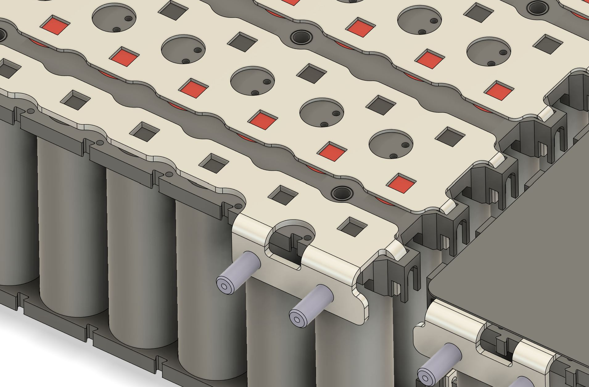
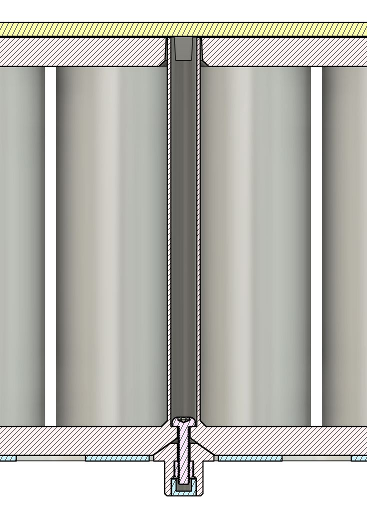
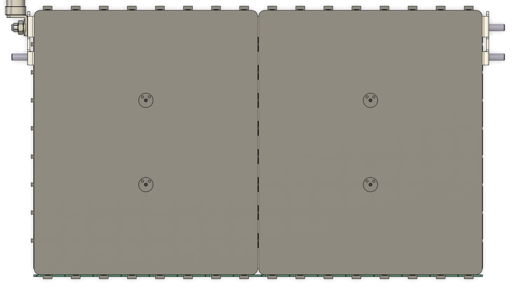

# Open-source battery pack for solar cars

## What is this?
This is the mechanical assembly for a battery pack intended for solar cars competing in common races like ASC or WSC. It's designed to be reasonably easy to fabricate and assemble, but without significantly compromising the quality of the design.

## Who are you?
I'm Sasha Zbrozek and I was trained as an electrical engineer. I was on Stanford's solar car team from 2006 through 2010 and continue to participate with them and the broader solar car community from the comfort of my golden years. I have a normal day job that takes up most of my time, but we've all got to have hobbies.

## Why did you make this?
I participated as a staff member in the 2025 Formula Sun Grand Prix and enjoyed working with the students immensely. I think the community would benefit from having more open-source hardware and software available for students to take, modify, and improve.

And why a battery pack specifically? I felt that many cars under-engineered them and that there was a lot of room to try and introduce improvements that would have both performance and safety benefits for solar racing as a whole.

## Are you going to open-source the BMS too?
When I get around to designing the cell monitoring board, I will open source that. No promises on the BMS main board, however. Those are pretty specific to each individual solar car. I will at least include a mechanical template for anyone who wants to design their own.

## Key design decisions and their motivations
### 32s9p arrangement
This pack is a 32 series, 9 parallel (32s9p) arrangement of [21700 cells](https://www.molicel.com/wp-content/uploads/Product-Data-Sheet-of-INR-21700-P50B-80122.pdf). This gives 134.4 volts top-of-charge with typical NMC cells. Using a power-of-two number of cells in series makes for really convenient bussing, allowing all bolted terminals to be on the top of the modules and for a wide range of module shapes. The voltage is reasonably safe for the Wavesculptor 22 and matches well with the super-beefy [MDE 30KPA132A TVS diode](https://mm.digikey.com/Volume0/opasdata/d220001/medias/docus/4180/30KPA_Series.pdf).

### Hybrid bus bars
Simple nickel sheet is pretty resistive and also dense. This design uses [aluminum bus bars with nickel inserts](https://www.everbestbattery.com/index.php?m=home&c=View&a=index&aid=171) for easy welding and high conductivity. Folded sheet metal also affords the opportunity for built-in studs for easy bolting where bolted joints cannot be avoided.

### Large modules
This design uses only two 16s9p modules in order to dramatically cut down on the number of high-current bolted joints. Those are failure-prone and can easily cause battery pack fires by igniting nearby plastics if the bolted joints lose preload and become high impedance.

This is likely to be a controversial choice; teams often want their packs to be more modular in order to have a smaller minimum serviceable unit. In my experience, packs get built once and then basically never touched again outside of reworks to address manufacturing defects. My goal is to enable a high-quality module to be built, tested, and installed once.

### Cell monitoring on the side of the module
There is a large PCBA that mounts to the side of the module and is supposed to hold all of the cell monitoring and balancing electronics. This is to try and reduce the amount of wire harnessing inside of the battery pack, which is often failure-prone and easily shorted by accident.

### Mostly sealed
Aside from the deliberate air ingest and exhaust paths, the battery pack is theoretically sealed (assuming good manufacturing quality). Solar cars don't always enjoy sunny weather, so it's important to keep dust and water out. It uses the engine air filter to keep out dust.

### 3D-printed cell spacer plates
The cell spacer plates are intended to be 3D printed in [PC FR](https://us.store.bambulab.com/products/pc-fr) with a 0.2 mm nozzle. I used a Bambu H2D. There are a number of features that would be difficult or impossible to replicate without 3D printing, like the zero-draft shields that prevent you from losing screws into the forest of cells:

...or the fluid channels that deliver low-viscosity glue to hold the cells in place:

### Mid-pack main fuse
A mid-pack fuse is a convenient way to halve the available electric potential (and thus quarter the available fault power) after a fault or during service. I prefer them to high- or low-side fuses. The mid-pack installation location also leverages the pack symmetry to reduce the total number of bolted joints.

### Shields
There are baffles that make it difficult to accidentally contact the sense taps on the bent parts of the bus bars:

There are also shields which go on the top side of the modules to reduce risks associated with leans and drops:

### Assembly aids
This design will come with a number of assembly aids to help with ergonomics, safety, or assembly quality. The first of these is a temporary handle that gets attached via screws from above while lifting and lowering the large modules into place into the battery pack.

## What's not done yet?
Lots! Off the top of my head:
- The air ingest filter hasn't been modeled and I haven't come up with a way to retain it.
- I haven't designed the duct-side collars.
- There is no sealing plug to prevent airflow from short-circuiting around the fuse yet.
- Ditto for the fuse-side harness passthrough between the two cell monitoring boards.
- There is no fuse cover yet.
- THere is no HV terminal cover yet.
- I don't like the LV battery retention scheme and will probably do it again.

## How do I use this?
A team looking to use this design will probably want to fork it and modify it to suit their vehicle. If you have any ideas for improvements, please file issues or create PRs and I'll consider including them upstream. Note that WSC and ASC have differing pack energy limitations, and so you may need to alter the number of parallel cells to match.

As this design matures I'll create additional documentation for things like the shopping list, tools needed for fabrication, and an assembly guide. For now, you'll need at least these tools and capabilities to reproduce the design:

- Ability to buy things from China with a wire transfer (bus bars)
- Ability to buy things from typical online vendors with a credit card (everything else)
- Ability to fixture an assembly and use epoxy to put it together
- Cell spot welding
- 3D printing in appropriate materials, primariliy PC FR and PA6-GF
- Routing / milling of large sandwich panels
- Standard and long reach Torx drivers
